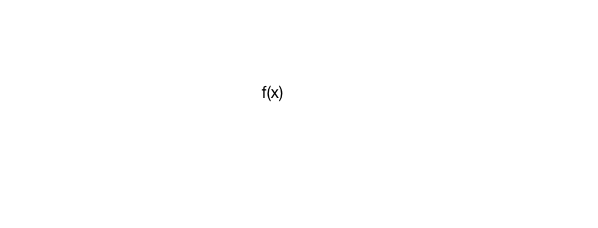

build-lists: true

# [fit] Aggressive Inline
## [fit] Higher-Order Functions in Kotlin

---

# David Greenhalgh
## @drgreenhalgh

---

# [fit] Aggressive Inline
## [fit] Higher-Order Functions in Kotlin

---

# [fit] Functions are first class citizens in Kotlin

---

# Simplest case, Java

```java
public class Sample {
  public static void main(String[] args) {
    // Do something
  }
}
```

---

# Simplest case, Kotlin

```kotlin
fun main(args: Array<String>) {
  // Do something
}
```

---

# Top-level declarations

```kotlin
fun main(args: Array<String>) {
  // Do something
}

class Example {

}

val flexible: Boolean = true
```

---

# Strings

In Java:

```java
String name = "Sophie"
```

In Kotlin:

```kotlin
val name: String = "Sophie"
```

---

# Integers

In Java:

```java
int count = 4
```

In Kotlin:

```kotlin
val count: Int = 4
```

---

# Function types

In Kotlin:

```kotlin
val camelCaseConverter: (String) -> String = { input ->
    input.split("_")
            .joinToString("") { it.capitalize() }
            .decapitalize()
}
```

---

# [fit] Lambda calculus

---

# Origins of lambda calculus

Alonzo Church


---

# Lambda calculus

$$
\lambda x.y
$$

---

# Function



---

# The arrow operator

```kotlin
(String) -> String
```

---

# The arrow operator

```kotlin
(String) -> String

"David" -> "DAVID"
```

---

# input -> output

```kotlin
val camelCaseConverter: (String) -> String = { input ->
    input.split("_")
            .joinToString("") { it.capitalize() }
            .decapitalize()
}
```

---

# input -> output

```kotlin, [.highlight: 7]
val camelCaseConverter: (String) -> String = { input ->
    input.split("_")
            .joinToString("") { it.capitalize() }
            .decapitalize()
}

"snake_case" -> "snakeCase"
```

---

# Storing references to functions

```kotlin, [.highlight: 1]
val camelCaseConverter: (String) -> String = { input ->
    input.split("_")
            .joinToString("") { it.capitalize() }
            .decapitalize()
}
```

---

# Function type invocation

```kotlin, [.highlight: 2, 6]
fun main(args: Array<String>) {
  val convertedString = camelCaseConverter("snake_case")
  println(convertedString)
}

val camelCaseConverter: (String) -> String = { input ->
    input.split("_")
            .joinToString("") { it.capitalize() }
            .decapitalize()
}
```

---

# Passing functions as arguments

```kotlin, [.highlight: 2,10]
fun main(args: Array<String>) {
  printFormattedText("snake_case", camelCaseConverter)
}

fun printFormattedText(text: String, 
                      caseConverter: (String) -> String) {
  val formattedText = caseConverter(text)
  println(formattedText)
}

val camelCaseConverter: (String) -> String = ...
```

---

# Higher-order functions

$$
f(x)
$$ is a function

$$
g(x)
$$ is a function

$$
f(g(x))
$$ is an implementation of $$f(x)$$ that takes $$g(x)$$ as input

---

# Higher-order functions

```kotlin
fun main(args: Array<String>) {
  printFormattedText("snake_case", camelCaseConverter)
}

fun printFormattedText(text: String, 
                      caseConverter: (String) -> String) {
  val formattedText = caseConverter(text)
  println(formattedText)
}

val camelCaseConverter: (String) -> String = ...
```

---

# Anonymous functions

```kotlin
fun main(args: Array<String>) {
    printFormattedText("snake_case", { input ->
        input.split("_")
            .joinToString("") { it.capitalize() } 
    })
}
```

---

# Last parameter SAM

```kotlin
fun main(args: Array<String>) {
    printFormattedText("snake_case") { input ->
        input.split("_")
            .joinToString("") { it.capitalize() }
    }
}
```

---

# Domain-specific languages

```kotlin
verticalLayout {
    val name = editText()
    button("Say Hello") {
        onClick { toast("Hello, ${name.text}!") }
    }
}
```

---

# Domain-specific languages

```kotlin, [.highlight: 4]
verticalLayout {
    val name = editText()
    button("Say Hello") {
        onClick { toast("Hello, ${name.text}!") }
    }
}
```

---

# Domain-specific languages

```kotlin
fun View.onClick(v: (View?) -> Unit) {
  setOnClickListener(v)
}
```

---

# Domain-specific languages

```kotlin
verticalLayout {
    val name = editText()
    button("Say Hello") {
        onClick { toast("Hello, ${name.text}!") }
    }
}
```

---

# [fit] Interoperability

---

# Java's FunctionN type

Pre-Java 8

```java
private static Function1<String, String> camelCaseConverter = 
    new Function1<String, String>() {
        @Override
        public String invoke(String s) {
            //...
        }
}
```

---

# Java's FunctionN type

Java 8+

```java
private static Function1<String, String> camelCaseConverter = 
    (Function1<String, String>) s -> {
        //...
    }
```

---

# Function0

In Kotlin:

```kotlin
val outputTwo: () -> Int = { 2 }
```

In Java:

```java
private static Function0<Integer> outputTwo = () -> 2;
```

---

# Function2

In Kotlin:

```kotlin
private val logicalOr = { aBoolean: Boolean, aBoolean2: Boolean -> 
    aBoolean || aBoolean2 
}
```

In Java:

```java
private static Function2<Boolean, Boolean, Boolean> logicalOr = 
    (aBoolean, aBoolean2) -> aBoolean || aBoolean2;
```

---

# Higher-order functions in Java

```java
public static void main(String[] args) {
  printFormattedText("snake_case", camelCaseConverter);
}

private static void printFormattedText(
    String text, 
    Function1<String, String> caseConverter) {
  System.out.println(caseConverter.invoke(text));
}

private static Function1<String, String> camelCaseConverter = ...
```

---

# Last parameter SAM in Java

```java, [.highlight: 2]
public static void main(String[] args) {
  printFormattedText("snake_case", camelCaseConverter);
}

private static void printFormattedText(
    String text, 
    Function1<String, String> caseConverter) {
  System.out.println(caseConverter.invoke(text));
}

private static Function1<String, String> camelCaseConverter = ...
```

---

# Performance implications of function types

* Additional object allocation

---

# Function inlining

Fold higher-order function into call site

* inline
* noinline
* crossinline

---

# inline

```kotlin
fun main(args: Array<String>) {
  printFormattedText("snake_case") { input ->
      input.split("_")
          .joinToString("") { it.capitalize() }
  }
}

fun printFormattedText(text: String, caseConverter: (String) -> String) {
  val formattedText = caseConverter(text)
  println(formattedText)
}
```

A Function1 is allocated for caseConverter.

---

# inline

An inlined function includes passed function contents at call site.

```kotlin, [.highlight: 8]
fun main(args: Array<String>) {
  printFormattedText("snake_case") { input ->
      input.split("_")
          .joinToString("") { it.capitalize() }
  }
}

inline fun printFormattedText(text: String, caseConverter: (String) -> String) {
  val formattedText = caseConverter(text)
  println(formattedText)
}
```

---
[.build-lists: false]

# inline

* Function contents inlined at call site
* No additional allocation

```kotlin, [.highlight: 9]
fun main(args: Array<String>) {
  printFormattedText("snake_case") { input ->
      input.split("_")
          .joinToString("") { it.capitalize() }
  }
}

inline fun printFormattedText(text: String, caseConverter: (String) -> String) {
  val formattedText = text.split("_").joinToString("") { it.capitalize() }
  println(formattedText)
}
```

---

# What's the catch?

* Passed functions are closures
* Potential errors from referencing anything inaccessible at call site

```kotlin
private val x = 4

val printPrivateValue: () -> Unit = {
  println(x)
}
```

---

# noinline

Specify that a function should not be inlined

```kotlin
inline fun printFormattedText(
    text: String, 
    caseConverter: (String) -> String
    noinline func: () -> Int) {
  val formattedText = text.split("_")
                        .joinToString("") { it.capitalize() }
  println(formattedText)
}
```

---

# noinline

Specify that a function should not be inlined

```kotlin, [.highlight: 1, 3-4, 8]
inline fun printFormattedText(
    text: String, 
    caseConverter: (String) -> String
    noinline func: () -> Int) {
  val formattedText = text.split("_")
                        .joinToString("") { it.capitalize() }
  println(formattedText)
}
```

---

# crossinline

Pass a function to another execution context

```kotlin
inline fun printFormattedText(
    text: String, 
    caseConverter: (String) -> String
    crossinline func: () -> Int) {
  Runnable {
    override fun run() = func()
  }
}
```

---

# crossinline

Pass a function to another execution context

```kotlin, [.highlight: 1, 3-8]
inline fun printFormattedText(
    text: String, 
    caseConverter: (String) -> String
    crossinline func: () -> Int) {
  Runnable {
    override fun run() = func()
  }
}
```

---

# [fit] Improved patterns

---

# Callback interfaces

```java
public static void main(String[] args) {
  EventListener listener = new EventListener() {
      @Override
      public void onEventOccurred() {
        // Do something
      }
  };
}

interface EventListener {
  void onEventOccurred();
}
```

---

# Callback interfaces

```java
public static void main(String[] args) {
  EventListener listener = ...
  
  someFunction(listener);
}

private void someFunction(EventListener listener) {
  ...
}
```

---

# Replacing callback interfaces

```kotlin
fun main(args: Array<String>) {
  someFunction {
    // Do something
  }
}

private fun someFunction(onEventOccurred: () -> Unit) {
  
}
```

---

# Functional programming

```kotlin
val animals = listOf("zebra", "giraffe", "elephant")
val babies = animals
    .map { animal -> "A baby $animal" }
    .map { baby -> "$baby, with a cute little nose!"}
println(babies)
```

```
A baby zebra, with a cute little nose!
A baby giraffe, with a cute little nose!
A baby elephant, with a cute little nose!
```

---

# Higher-order functions and you

* Replace your callback interfaces
* Enable intuitive syntax
* Be responsible about performance
* Consider interoperability

---

# [fit] Aggressive Inline
## [fit] Higher-Order Functions in Kotlin